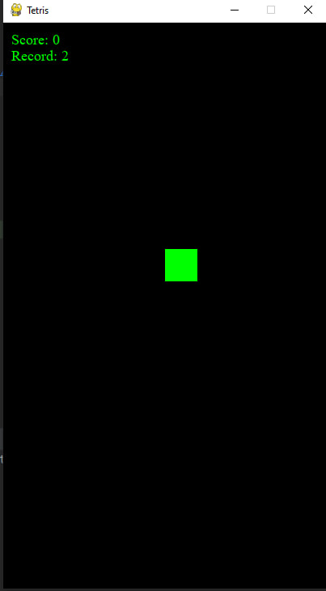

# Tetris_Game_Python (application features)
Фишки :
* Каждая 5-ая фигура будет крутиться, и нужно будет рандомным нажатием клавиши остановить фигуру, после этого она начнет падать, но без возможности изменить положения фигуры 

Бонусы :
  * сохранение результатов игрока после закрытия игры
  * Увелечение сложности игры со временем
  * Релизование шейринга своего рекорда
  * Добовление в игру новых деталий (фишек)

## Installation

Create python venv (Python 3.8).

```bash
python -m venv venv
```
Activate python venv.

```bash
source venv/bin/activate
```
or 
```bash
.\venv\activate
```
Use the package manager [pip](https://pip.pypa.io/en/stable/) to install the requirements file.

```bash
pip3 install -r requirements.txt
```

## Usage

```bash
# run python project 
python3 main.py
```

## Final
